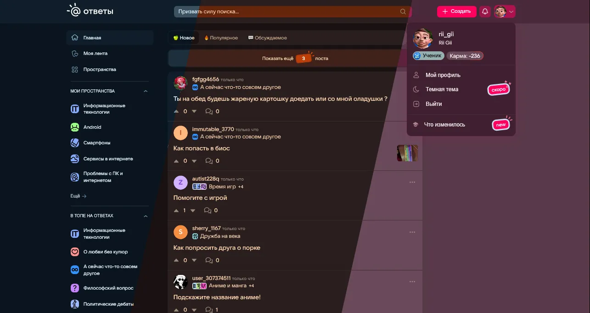
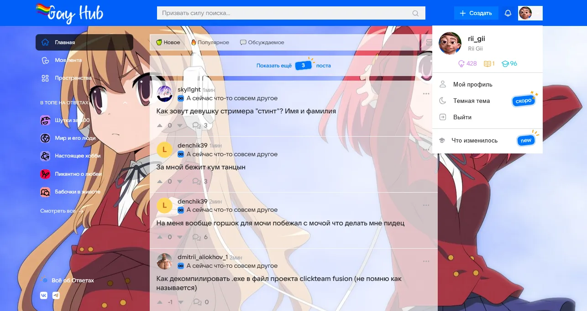

# Otvet-Mail-CSS-Themes

###maildark сейчас переименован в Otvet MailRu Theme Customizer. Этот стиль был написан чтобы добавить банальную тёмную тему, которую делали больше полугода. В итоге всё переросло в полностью настраиваемую тему.

Интересный факт: Базовые цвета тёмной темы мною были спёрты с ВК 2021 года. Акцентовый цвет полупрозрачный потому что, первое: ну я просто не знал какой у вк был акцент, а оказывается белый. второе: я не хотел чтобы DarkReader был сильно похож. Он не трогает акцентовые цвета, в отличии от меня. 

###mailnew это прямой приемник моего первого кода ещё для старого интерфейса.

